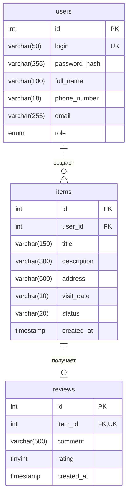

```mermaid
erDiagram
    users ||..o{ items : "создаёт"
    items ||..o| reviews : "получает"
    users {
        int id PK
        varchar(50) login UK
        varchar(255) password_hash
        varchar(100) full_name
        varchar(18) phone_number
        varchar(255) email
        enum role
    }
    items {
        int id PK
        int user_id FK
        varchar(150) title
        varchar(300) description
        varchar(500) address
        varchar(10) visit_date
        varchar(20) status
        timestamp created_at
    }
    reviews {
        int id PK
        int item_id FK, UK
        varchar(500) comment
        tinyint rating
        timestamp created_at
    }
```